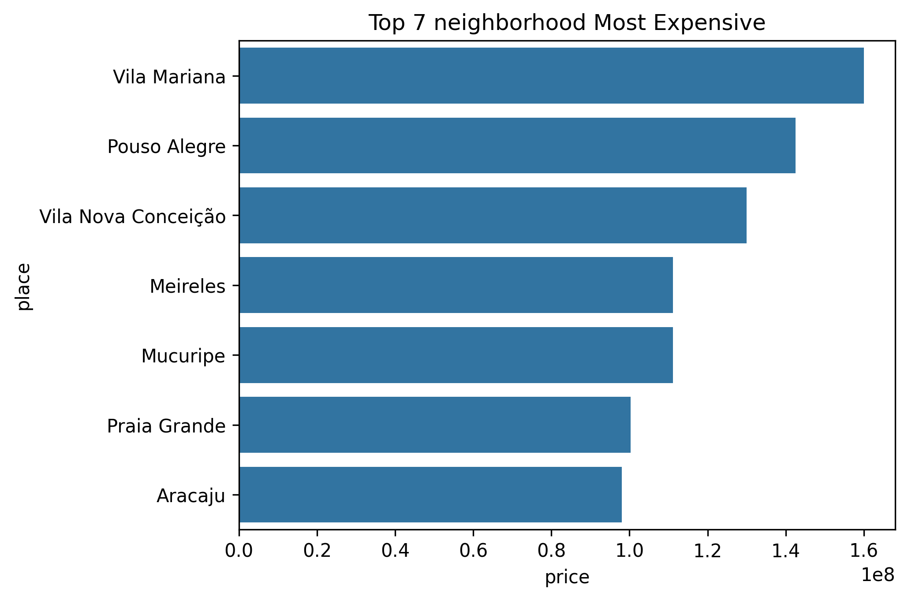
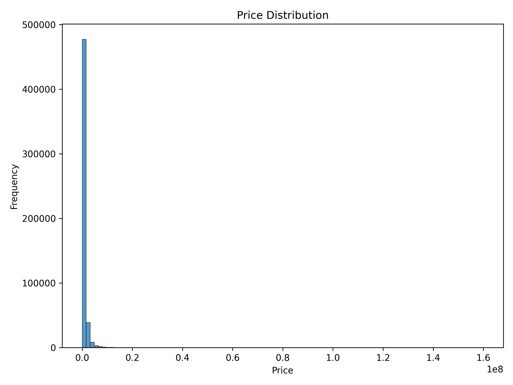

# Predição de Preços de Imóveis

Este projeto utiliza técnicas de Ciência de Dados e Machine Learning para prever o preço de imóveis no Brasil, com base em características como localização, número de quartos, tamanho do imóvel e outros atributos. Os dados foram coletados pelo Properati e estão disponíveis no dataset Brazil Real Estate Listings no Kaggle.

## Fonte dos Dados

- [Kaggle – Brazil Real Estate Listings](https://www.kaggle.com/datasets/devvret/brazil-real-estate-listings)

## Objetivos

- Fazer **exploração de dados (EDA)** para entender padrões de preço, distribuição por cidade/região e demais estatísticas.
- Realizar **modelagem preditiva** (exemplo: regressão ou clustering) para identificar fatores que influenciam preços ou agrupar perfis de imóveis.
- Desenvolver insights úteis para corretoras ou compradores.

## Metodologia

1. **EDA**:
   - Histogramas de preço
   - Boxplots comparando bairros
   - Correlações (área vs preço, quartos vs preço, etc.)
2. **Pré-Processamento**:
   - Tratar valores faltantes
   - Converter colunas de data em formato adequado
   - Filtrar outliers ou dados inconsistentes
   - Codificar variáveis categóricas
   - Normalização
   - Redução de dimensionalidade
4. **Modelagem**:
   - Random Forest
5. **Avaliação**:
   - Métricas como MAE, R²
   - Validação cruzada

## Exemplos de Visualizações

### Neighborhood Most Expensive


### Distribuição de Preços


### Correlação entre Variáveis


### Importância das Features
 

## Como executar

```bash
git clone https://github.com/seuusuario/seu_projeto_imoveis.git
cd seu_projeto_imoveis
pip install -r requirements.txt
jupyter notebook
```
## Contribuir

Contribuições são bem-vindas!
Faça um fork, crie uma branch com suas melhorias e abra um pull request.
